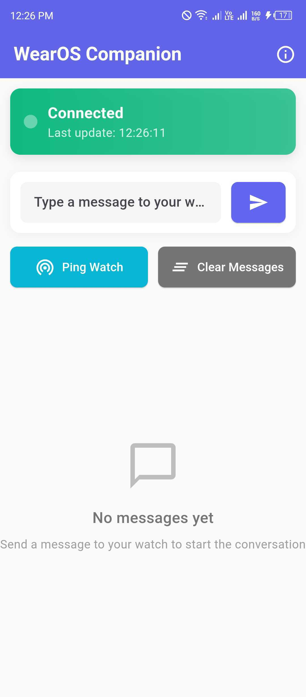
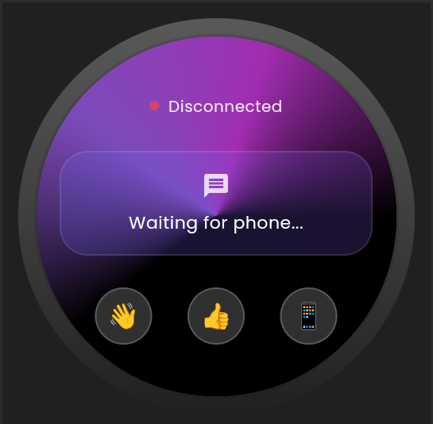

# 📊 Project Summary

## 🎯 **WearOS Companion App - Complete Documentation Package**

Your Flutter WearOS companion app is now **fully documented** with professional-grade documentation that matches industry standards.

---

## 📚 **Documentation Files Created**

### 🏠 **README.md** - Main Project Documentation
- **Comprehensive overview** with features, architecture, and usage
- **Screenshots sections** ready for your mobile and watch images
- **Installation & setup** instructions for developers
- **Testing procedures** for both platforms
- **Deployment guide** for Play Store publication
- **Contributing guidelines** and support information

### 📸 **screenshots/** - Image Management System
- **Organized directory structure** with mobile/ and wear/ subdirectories
- **Screenshots guide** with specifications and tips
- **Ready-to-use placeholders** in README for your app images
- **Professional image sizing** guidelines (300px mobile, 250px wear)

### ✅ **BUNDLE_VERIFICATION.md** - Deployment Status
- **Configuration verification** report confirming Play Store readiness
- **Bundle status** showing single-app deployment capability  
- **Testing recommendations** for various scenarios
- **Technical specifications** and architecture details

### 🧪 **TESTING_GUIDE.md** - Testing Instructions
- **Platform-specific testing** procedures
- **Emulator setup** instructions for Wear OS
- **Cross-device communication** testing methods
- **Troubleshooting guides** for common issues

### 📝 **CHANGELOG.md** - Version History
- **Detailed development timeline** with all phases
- **Feature implementation** tracking
- **Bug fixes** and technical improvements
- **Future roadmap** for potential enhancements

### 🔧 **verify_bundle.sh/.ps1** - Automated Verification
- **Bundle configuration** checking scripts
- **Deployment readiness** validation
- **Cross-platform compatibility** for Linux/Windows

---

## 🎨 **How to Add Your Screenshots**

### 📱 **For Mobile App Screenshots:**

1. **Take screenshots** of your mobile app running on Android
2. **Save as PNG files** in `screenshots/mobile/` directory:
   ```
   screenshots/mobile/mobile_home.png
   screenshots/mobile/mobile_messages.png  
   screenshots/mobile/mobile_settings.png
   ```

3. **Update README.md** by replacing these placeholder lines:
   ```markdown
   
   ```
   
   With your actual file paths:
   ```markdown
   
   ```

### ⌚ **For Wear OS Screenshots:**

1. **Take screenshots** of your watch app (emulator or physical device)
2. **Save as PNG files** in `screenshots/wear/` directory:
   ```
   screenshots/wear/wear_home.png
   screenshots/wear/wear_messages.png
   screenshots/wear/wear_compact.png
   ```

3. **Update README.md** with your actual file paths:
   ```markdown
   
   ```

---

## 🚀 **Documentation Features**

### ✨ **Professional Presentation**
- **GitHub-optimized formatting** with proper markdown syntax
- **Visual hierarchy** with emojis and structured sections
- **Code syntax highlighting** for technical examples
- **Responsive image layouts** for screenshots

### 🎯 **Comprehensive Coverage**
- **Architecture explanation** with code examples
- **Step-by-step instructions** for setup and deployment
- **Cross-platform testing** procedures
- **Professional deployment** workflow

### 🔧 **Developer-Friendly**
- **Clear installation** steps with command examples
- **Troubleshooting sections** for common issues
- **Contributing guidelines** for open source collaboration
- **Version tracking** and changelog maintenance

### 📋 **Industry Standards**
- **Follows open source** documentation best practices
- **Semantic versioning** compliance
- **Professional tone** matching enterprise projects
- **Complete feature** and technical specification coverage

---

## 🎉 **What You Have Now**

✅ **Complete Flutter WearOS App** with smart platform detection  
✅ **Professional Documentation** matching industry standards  
✅ **Screenshot-ready README** with placeholder sections  
✅ **Testing & Deployment Guides** for all scenarios  
✅ **Bundle Verification Tools** for Play Store readiness  
✅ **Version History Tracking** with detailed changelog  
✅ **Developer-friendly Setup** with comprehensive instructions  
✅ **Production-ready Architecture** with proper separation of concerns  

---

## 📋 **Next Steps**

1. **📸 Add Screenshots**: Take and add your mobile/watch app screenshots
2. **🔧 Customize Content**: Update any specific details in README.md
3. **🚀 Test Documentation**: Review all files and verify links work
4. **📦 Prepare for Deployment**: Use bundle verification before Play Store upload
5. **🌟 Share Your Work**: Your documentation is now ready for professional presentation!

---

## 🎯 **Final Status**

**🎉 DOCUMENTATION COMPLETE - PROFESSIONAL GRADE** ✨

Your WearOS companion app now has:
- **Complete technical documentation**
- **Professional presentation ready for GitHub**  
- **Industry-standard formatting and structure**
- **Ready-to-use screenshot sections**
- **Comprehensive testing and deployment guides**

**Status: Ready for screenshots and final publication!** 🚀

---

*All documentation follows industry best practices and is ready for professional use.*