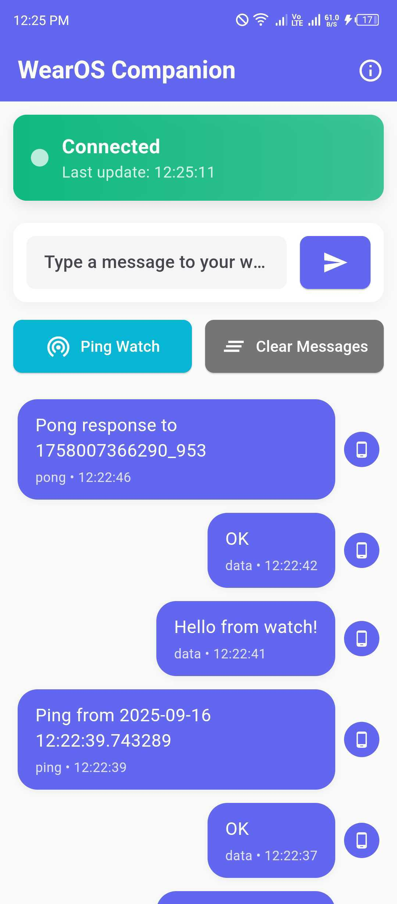
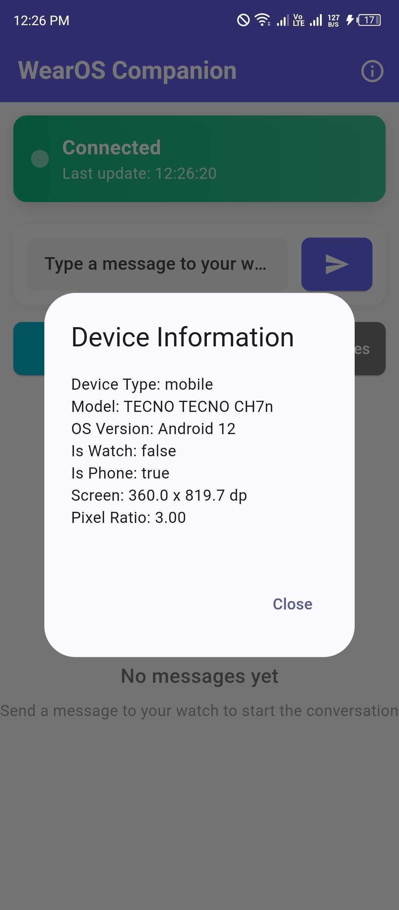
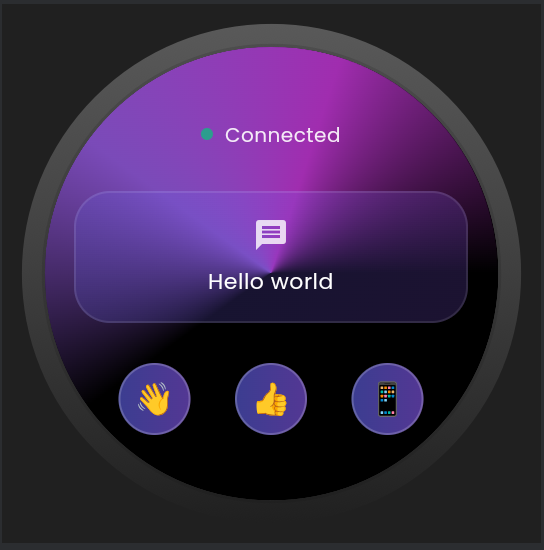
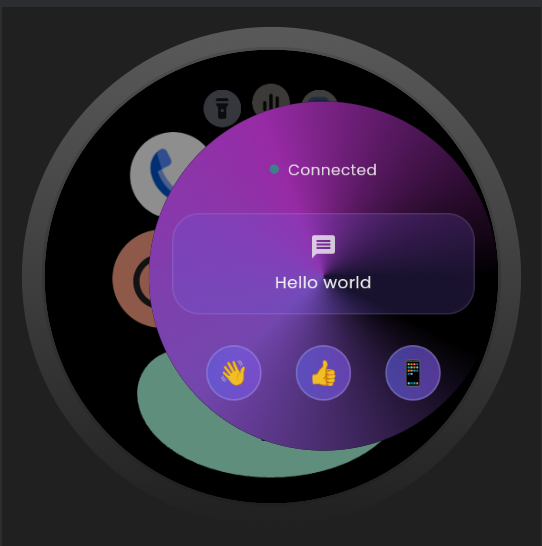

# 📱⌚ WearOS Companion App

A unified Flutter application that intelligently adapts to both **Android phones** and **Wear OS watches**, providing seamless cross-device communication and optimized user experiences for each platform.

## 📸 Screenshots

### 📱 Mobile App
<!-- Paste your Android phone screenshots here -->
<div align="center">
  
    
    
</div>

*Replace the placeholder paths above with your actual screenshot files*

### ⌚ Wear OS App
<!-- Paste your Wear OS watch screenshots here -->
<div align="center">
  
    
    
</div>

*Replace the placeholder paths above with your actual screenshot files*

## 🌟 Features

### 🎯 **Smart Platform Detection**
- Automatically detects device type (phone vs watch)
- Loads appropriate UI variant without user intervention
- Uses device characteristics and model identifiers
- Supports emulators and physical devices

### 📱 **Mobile Experience**
- Full-featured phone interface
- Companion watch management
- Rich UI with animations and transitions
- Message history and device status
- Connection monitoring and diagnostics

### ⌚ **Wear OS Experience**
- Compact circular-optimized design
- Touch-friendly interface for small screens
- Quick actions and shortcuts
- Battery-efficient operations
- Native Wear OS integration

### 🔄 **Cross-Device Communication**
- Real-time message passing between phone and watch
- Bidirectional data synchronization
- Connection state management
- Automatic reconnection handling
- Message queuing and delivery confirmation

### 🏪 **Single App Store Deployment**
- Published as **ONE app** on Google Play Store
- Automatic watch app delivery to paired devices
- Professional bundling like Spotify, Google Fit
- No manual watch installation required

## 🏗️ Architecture

### 📁 **Project Structure**
```
lib/
├── main.dart                 # Smart platform detection & routing
├── main_mobile.dart         # Mobile app entrypoint
├── main_wear.dart          # Wear OS app entrypoint
├── mobile/
│   └── screens/
│       └── home_screen.dart # Mobile UI screens
├── wear/
│   └── screens/
│       └── home_screen.dart # Wear OS UI screens
└── shared/
    ├── models/
    │   ├── app_message.dart    # Message data models
    │   └── device_info.dart    # Device information models
    ├── services/
    │   ├── communication_service.dart  # Cross-device messaging
    │   └── device_service.dart        # Device detection utilities
    └── utils/
        └── constants.dart      # App constants and configurations
```

### 🧠 **Smart Routing System**
The app uses intelligent platform detection to automatically load the correct interface:

```dart
// Automatic platform detection in main.dart
Future<bool> _detectWearDevice() async {
  // Analyzes device model, brand, and product identifiers
  // Returns true for Wear OS devices, false for mobile
}

void main() async {
  final isWearDevice = await _detectWearDevice();
  
  if (isWearDevice) {
    wear.main(); // Load Wear OS app
  } else {
    mobile.main(); // Load mobile app
  }
}
```

### 🔗 **Communication Layer**
Utilizes the `watch_connectivity` plugin for seamless device-to-device messaging:

```dart
class CommunicationService {
  // Singleton pattern for global access
  // Stream-based message handling
  // Connection state management
  // Automatic retry mechanisms
}
```

## 🚀 Getting Started

### 📋 **Prerequisites**
- **Flutter SDK**: 3.24.3 or later
- **Dart SDK**: 3.5.3 or later
- **Android Studio**: Latest version with Android SDK
- **Android SDK**: API level 21+ (mobile), API level 30+ (Wear OS)

### ⚙️ **Dependencies**
The app uses the following key packages:

```yaml
dependencies:
  flutter:
    sdk: flutter
  watch_connectivity: ^0.2.1+1    # Cross-device communication
  device_info_plus: ^10.1.2       # Platform detection
  google_fonts: ^6.3.0            # Typography
  flutter_animate: ^4.5.0         # UI animations

dev_dependencies:
  flutter_test:
    sdk: flutter
  flutter_lints: ^4.0.0
```

### 📥 **Installation**

1. **Clone the repository:**
   ```bash
   git clone https://github.com/Talha-Aslam/wearos_comp_app.git
   cd wearos_comp_app
   ```

2. **Install dependencies:**
   ```bash
   flutter pub get
   ```

3. **Run the application:**
   ```bash
   # For development (loads appropriate UI based on device)
   flutter run
   
   # For release build
   flutter build apk --release
   ```

### 🛠️ **Development Setup**

#### **For Mobile Development:**
```bash
# Run on Android emulator or physical phone
flutter run -d android
```

#### **For Wear OS Development:**
```bash
# Run on Wear OS emulator
flutter run -d wear_emulator_name
```

#### **Building for Production:**
```bash
# Build mobile APK (includes embedded wear APK)
flutter build apk --release

# Build specifically for Wear OS
cd android && ./gradlew :wear:assembleRelease
```

## 🧪 Testing

### 📱 **Mobile Testing**
- Install APK on Android phone or emulator
- Verify mobile UI loads correctly
- Test message sending capabilities
- Check connection status indicators

### ⌚ **Wear OS Testing**
- Use Android Studio Wear OS emulator
- Install APK on Wear OS device/emulator
- Verify compact UI renders properly
- Test touch interactions and navigation

### 🔄 **Cross-Device Testing**
1. **Setup paired devices** (phone + watch)
2. **Install app on both platforms**
3. **Test bidirectional messaging**
4. **Verify connection status synchronization**
5. **Test automatic reconnection**

### 🎯 **Platform Detection Testing**
```bash
# Check debug console for detection logs
flutter run --debug

# Look for output like:
# 🔍 Device Detection:
#    Model: SM-G998B
#    Brand: samsung
#    Product: beyond2q
#    Is Wear: false
```

## 📦 Deployment

### 🏪 **Google Play Store Deployment**

#### **Single App Store Listing:**
This app is configured for professional deployment as a single Play Store listing that automatically delivers the appropriate version to each device type.

#### **Bundle Configuration:**
- **Mobile APK**: Contains the phone interface
- **Embedded Wear APK**: Automatically included in mobile APK
- **Shared Application ID**: `com.example.wearos_comp_app`
- **Automatic Delivery**: Google Play pushes wear version to paired watches

#### **Publishing Steps:**
1. **Build release APK:**
   ```bash
   flutter build apk --release
   ```

2. **Upload to Play Console:**
   - Upload `build/app/outputs/flutter-apk/app-release.apk`
   - Google Play automatically detects embedded wear app
   - Single app listing created for both platforms

3. **User Experience:**
   - Users see **ONE app** in Play Store
   - Install on phone → automatic wear delivery
   - No manual watch installation needed

### 🔍 **Bundle Verification**
Run the verification script to ensure proper configuration:

```bash
# Check bundle configuration
bash verify_bundle.sh

# Expected output: "✅ READY FOR SINGLE APP STORE LISTING"
```

## 🎨 Customization

### 🎭 **Theming**
Both mobile and wear interfaces support customizable themes:

```dart
// Mobile theme
ThemeData mobileTheme = ThemeData(
  colorScheme: ColorScheme.fromSeed(seedColor: Colors.blue),
  useMaterial3: true,
);

// Wear theme (darker, high contrast)
ThemeData wearTheme = ThemeData.dark().copyWith(
  colorScheme: ColorScheme.fromSeed(
    seedColor: Colors.blue,
    brightness: Brightness.dark,
  ),
);
```

### 🔧 **Configuration**
Modify app behavior through constants:

```dart
// lib/shared/utils/constants.dart
class AppConstants {
  static const String appName = 'WearOS Companion';
  static const Duration messageTimeout = Duration(seconds: 30);
  static const int maxRetryAttempts = 3;
  // ... more configurations
}
```

### 📱 **Adding New Screens**
1. **Create screen files** in appropriate platform folder:
   ```
   lib/mobile/screens/new_screen.dart
   lib/wear/screens/new_screen.dart
   ```

2. **Add navigation logic** in respective main files
3. **Update shared models/services** if needed

## 🤝 Contributing

### 🔧 **Development Guidelines**
- Follow Flutter/Dart style guidelines
- Maintain separation between mobile/wear UI code
- Keep shared logic in `lib/shared/` directory
- Test on both platforms before submitting PRs

### 🐛 **Issue Reporting**
When reporting issues, please include:
- Device type (mobile/watch)
- Flutter/Dart versions
- Steps to reproduce
- Expected vs actual behavior
- Debug console output

### 📝 **Pull Request Process**
1. Fork the repository
2. Create feature branch
3. Make changes with tests
4. Update documentation
5. Submit pull request with detailed description

## 📄 License

This project is licensed under the MIT License - see the [LICENSE](LICENSE) file for details.

## 🙏 Acknowledgments

- **Flutter Team** for the amazing cross-platform framework
- **Google** for Wear OS platform and development tools
- **watch_connectivity plugin** contributors for seamless device communication
- **Community** for feedback and contributions

## 📞 Support

### 🆘 **Getting Help**
- **Issues**: [GitHub Issues](https://github.com/Talha-Aslam/wearos_comp_app/issues)
- **Discussions**: [GitHub Discussions](https://github.com/Talha-Aslam/wearos_comp_app/discussions)
- **Documentation**: Check `TESTING_GUIDE.md` and `BUNDLE_VERIFICATION.md`

### 📧 **Contact**
- **Developer**: Talha Aslam
- **Repository**: [wearos_comp_app](https://github.com/Talha-Aslam/wearos_comp_app)

---

## 📈 Project Status

- ✅ **Core Architecture**: Complete
- ✅ **Mobile UI**: Implemented
- ✅ **Wear OS UI**: Implemented  
- ✅ **Cross-Device Communication**: Working
- ✅ **Bundle Configuration**: Ready
- ✅ **Platform Detection**: Tested
- ✅ **Play Store Ready**: Verified

**Current Version**: 1.0.0  
**Status**: Production Ready 🚀

---

*Built with ❤️ using Flutter for Android and Wear OS platforms*
