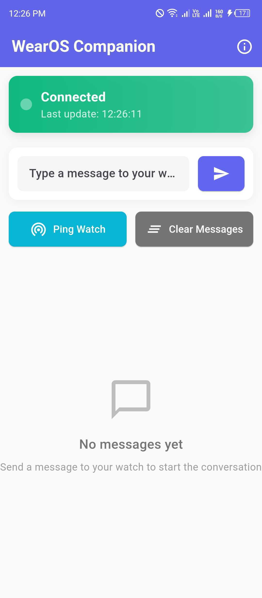

# 📱⌚ Universal Companion App

A unified Flutter application that intelligently adapts to **Android phones**, **Wear OS watches**, **iOS devices**, and **watchOS (Apple Watch)**, providing seamless cross-device communication and optimized user experiences for each platform.

## 📸 Screenshots

### 📱 Mobile Apps
<!-- Paste your Android and iOS phone screenshots here -->
<div align="center">
  
  
  
</div>

*Replace the placeholder paths above with your actual screenshot files*

### ⌚ Watch Apps  
<!-- Paste your Wear OS and watchOS screenshots here -->
<div align="center">
  
  
  
</div>

*Replace the placeholder paths above with your actual screenshot files*


## 🌟 Features

### 🎯 **Smart Platform Detection**
- Automatically detects device type (Android/iOS phones vs Wear OS/watchOS watches)
- Loads appropriate UI variant without user intervention
- Uses device characteristics and model identifiers
- Supports emulators and physical devices across all platforms

### 📱 **Mobile Experience (Android & iOS)**
- **Android**: Material Design 3 with native Android patterns
- **iOS**: Cupertino Design with native iOS look and feel
- Full-featured phone interface with companion watch management
- Rich UI with animations and platform-specific transitions
- Message history and device status monitoring
- Cross-platform communication capabilities

### ⌚ **Watch Experience (Wear OS & watchOS)**
- **Wear OS**: Compact circular-optimized Material Design
- **watchOS**: Dark-themed Apple Watch optimized interface
- Touch-friendly interface designed for small circular screens
- Quick actions and predefined message shortcuts
- Battery-efficient operations
- Platform-native integration (Wear OS/watchOS)

### 🔄 **Cross-Platform Communication**
- Real-time message passing between phones and watches
- **Android ↔ Wear OS**: Using WatchConnectivity plugin
- **iOS ↔ watchOS**: Using Apple's WatchConnectivity framework
- Bidirectional data synchronization across all platforms
- Connection state management and automatic reconnection
- Message queuing and delivery confirmation

### 🏪 **Universal App Store Deployment**
- **Android**: Single Play Store listing with automatic Wear OS delivery
- **iOS**: Single App Store listing with automatic Apple Watch delivery  
- Professional bundling like major apps (Spotify, Google Fit, WhatsApp)
- No manual watch installation required on either platform
- Message queuing and delivery confirmation

### 🏪 **Single App Store Deployment**
- Published as **ONE app** on Google Play Store
- Automatic watch app delivery to paired devices
- Professional bundling like Spotify, Google Fit
- No manual watch installation required

## 🏗️ Architecture

### 📁 **Project Structure**
```
lib/
├── main.dart                    # Smart 4-platform detection & routing
├── main_mobile.dart            # Android mobile app entrypoint
├── main_wear.dart              # Wear OS app entrypoint  
├── main_ios.dart               # iOS mobile app entrypoint
├── main_watchos.dart           # watchOS app entrypoint
├── mobile/
│   └── screens/
│       └── home_screen.dart    # Android Material Design UI
├── wear/
│   └── screens/
│       └── home_screen.dart    # Wear OS compact UI
├── ios/
│   └── screens/
│       └── ios_home_screen.dart    # iOS Cupertino Design UI
├── watchos/
│   └── screens/
│       └── watchos_home_screen.dart # watchOS compact UI
└── shared/
    ├── models/
    │   ├── app_message.dart        # Cross-platform message models
    │   └── device_info.dart        # Device detection models
    ├── services/
    │   ├── communication_service.dart  # Universal messaging service
    │   └── device_service.dart         # Platform detection service
    └── utils/
        └── constants.dart          # App constants and configurations
```

### 🧠 **Smart Routing System**
The app uses intelligent platform detection to automatically load the correct interface:

```dart
enum PlatformType {
  android,    // Android phones
  wearOS,     // Wear OS watches  
  iOS,        // iPhones/iPads
  watchOS,    // Apple Watches
}

// Automatic 4-platform detection in main.dart
Future<PlatformType> _detectPlatformType() async {
  // Analyzes device characteristics across all platforms
  // Returns appropriate platform type for smart routing
}

void main() async {
  final platformType = await _detectPlatformType();
  
  switch (platformType) {
    case PlatformType.wearOS:
      wear.main();     // Load Wear OS app
      break;
    case PlatformType.watchOS:
      watchos.main();  // Load watchOS app
      break;
    case PlatformType.iOS:
      ios.main();      // Load iOS app
      break;
    case PlatformType.android:
    default:
      mobile.main();   // Load Android app
  }
}
```

### 🔗 **Communication Layer**
Utilizes universal communication plugins for cross-platform messaging:

```dart
class CommunicationService {
  // Singleton pattern for global access
  // Works across Android/Wear OS and iOS/watchOS
  // Stream-based message handling
  // Platform-agnostic connection management
  // Automatic retry mechanisms for all platforms
}
```

### 🎨 **Platform-Specific Themes**
Each platform gets its native look and feel:

```dart
// Android: Material Design 3
ThemeData materialTheme = ThemeData(useMaterial3: true);

// Wear OS: Compact Material Design  
ThemeData wearTheme = ThemeData.dark();

// iOS: Cupertino Design
ThemeData iosTheme = CupertinoTheme.of(context);

// watchOS: Dark Cupertino optimized for OLED
ThemeData watchosTheme = ThemeData.dark().copyWith(...);
```

## 🚀 Getting Started

### 📋 **Prerequisites**
- **Flutter SDK**: 3.24.3 or later
- **Dart SDK**: 3.5.3 or later
- **Android Studio**: Latest version with Android SDK
- **Android SDK**: API level 21+ (mobile), API level 30+ (Wear OS)

### ⚙️ **Dependencies**
The app uses the following key packages:

```yaml
dependencies:
  flutter:
    sdk: flutter
  watch_connectivity: ^0.2.1+1    # Cross-device communication
  device_info_plus: ^10.1.2       # Platform detection
  google_fonts: ^6.3.0            # Typography
  flutter_animate: ^4.5.0         # UI animations

dev_dependencies:
  flutter_test:
    sdk: flutter
  flutter_lints: ^4.0.0
```

### 📥 **Installation**

1. **Clone the repository:**
   ```bash
   git clone https://github.com/Talha-Aslam/wearos_comp_app.git
   cd wearos_comp_app
   ```

2. **Install dependencies:**
   ```bash
   flutter pub get
   ```

3. **Run the application:**
   ```bash
   # For development (loads appropriate UI based on device)
   flutter run
   
   # For release build
   flutter build apk --release
   ```

### 🛠️ **Development Setup**

#### **For Mobile Development:**
```bash
# Run on Android emulator or physical phone
flutter run -d android
```

#### **For Wear OS Development:**
```bash
# Run on Wear OS emulator
flutter run -d wear_emulator_name
```

#### **Building for Production:**
```bash
# Build mobile APK (includes embedded wear APK)
flutter build apk --release

# Build specifically for Wear OS
cd android && ./gradlew :wear:assembleRelease
```

## 🧪 Testing

### 📱 **Mobile Testing**
- Install APK on Android phone or emulator
- Verify mobile UI loads correctly
- Test message sending capabilities
- Check connection status indicators

### ⌚ **Wear OS Testing**
- Use Android Studio Wear OS emulator
- Install APK on Wear OS device/emulator
- Verify compact UI renders properly
- Test touch interactions and navigation

### 🔄 **Cross-Device Testing**
1. **Setup paired devices** (phone + watch)
2. **Install app on both platforms**
3. **Test bidirectional messaging**
4. **Verify connection status synchronization**
5. **Test automatic reconnection**

### 🎯 **Platform Detection Testing**
```bash
# Check debug console for detection logs
flutter run --debug

# Look for output like:
# 🔍 Device Detection:
#    Model: SM-G998B
#    Brand: samsung
#    Product: beyond2q
#    Is Wear: false
```

## 📦 Deployment

### 🏪 **Google Play Store Deployment**

#### **Single App Store Listing:**
This app is configured for professional deployment as a single Play Store listing that automatically delivers the appropriate version to each device type.

#### **Bundle Configuration:**
- **Mobile APK**: Contains the phone interface
- **Embedded Wear APK**: Automatically included in mobile APK
- **Shared Application ID**: `com.example.wearos_comp_app`
- **Automatic Delivery**: Google Play pushes wear version to paired watches

#### **Publishing Steps:**
1. **Build release APK:**
   ```bash
   flutter build apk --release
   ```

2. **Upload to Play Console:**
   - Upload `build/app/outputs/flutter-apk/app-release.apk`
   - Google Play automatically detects embedded wear app
   - Single app listing created for both platforms

3. **User Experience:**
   - Users see **ONE app** in Play Store
   - Install on phone → automatic wear delivery
   - No manual watch installation needed

### 🔍 **Bundle Verification**
Run the verification script to ensure proper configuration:

```bash
# Check bundle configuration
bash verify_bundle.sh

# Expected output: "✅ READY FOR SINGLE APP STORE LISTING"
```

## 🎨 Customization

### 🎭 **Theming**
Both mobile and wear interfaces support customizable themes:

```dart
// Mobile theme
ThemeData mobileTheme = ThemeData(
  colorScheme: ColorScheme.fromSeed(seedColor: Colors.blue),
  useMaterial3: true,
);

// Wear theme (darker, high contrast)
ThemeData wearTheme = ThemeData.dark().copyWith(
  colorScheme: ColorScheme.fromSeed(
    seedColor: Colors.blue,
    brightness: Brightness.dark,
  ),
);
```

### 🔧 **Configuration**
Modify app behavior through constants:

```dart
// lib/shared/utils/constants.dart
class AppConstants {
  static const String appName = 'WearOS Companion';
  static const Duration messageTimeout = Duration(seconds: 30);
  static const int maxRetryAttempts = 3;
  // ... more configurations
}
```

### 📱 **Adding New Screens**
1. **Create screen files** in appropriate platform folder:
   ```
   lib/mobile/screens/new_screen.dart
   lib/wear/screens/new_screen.dart
   ```

2. **Add navigation logic** in respective main files
3. **Update shared models/services** if needed

## 🤝 Contributing

### 🔧 **Development Guidelines**
- Follow Flutter/Dart style guidelines
- Maintain separation between mobile/wear UI code
- Keep shared logic in `lib/shared/` directory
- Test on both platforms before submitting PRs

### 🐛 **Issue Reporting**
When reporting issues, please include:
- Device type (mobile/watch)
- Flutter/Dart versions
- Steps to reproduce
- Expected vs actual behavior
- Debug console output

### 📝 **Pull Request Process**
1. Fork the repository
2. Create feature branch
3. Make changes with tests
4. Update documentation
5. Submit pull request with detailed description

## 📄 License

This project is licensed under the MIT License - see the [LICENSE](LICENSE) file for details.

## 🙏 Acknowledgments

- **Flutter Team** for the amazing cross-platform framework
- **Google** for Wear OS platform and development tools
- **watch_connectivity plugin** contributors for seamless device communication
- **Community** for feedback and contributions

## 📞 Support

### 🆘 **Getting Help**
- **Issues**: [GitHub Issues](https://github.com/Talha-Aslam/wearos_comp_app/issues)
- **Discussions**: [GitHub Discussions](https://github.com/Talha-Aslam/wearos_comp_app/discussions)
- **Documentation**: Check `TESTING_GUIDE.md` and `BUNDLE_VERIFICATION.md`

### 📧 **Contact**
- **Developer**: Talha Aslam
- **Repository**: [wearos_comp_app](https://github.com/Talha-Aslam/wearos_comp_app)

---

## 📈 Project Status

- ✅ **Core Architecture**: Complete
- ✅ **Mobile UI**: Implemented
- ✅ **Wear OS UI**: Implemented  
- ✅ **Cross-Device Communication**: Working
- ✅ **Bundle Configuration**: Ready
- ✅ **Platform Detection**: Tested
- ✅ **Play Store Ready**: Verified

**Current Version**: 1.0.0  
**Status**: Production Ready 🚀

---

*Built with ❤️ using Flutter for Android and Wear OS platforms*
